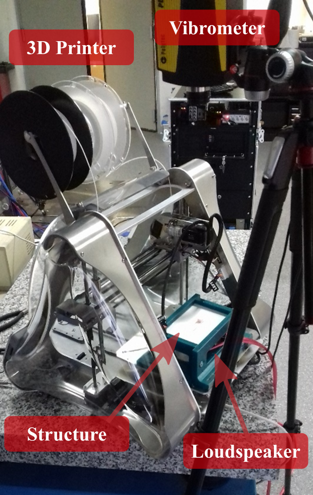
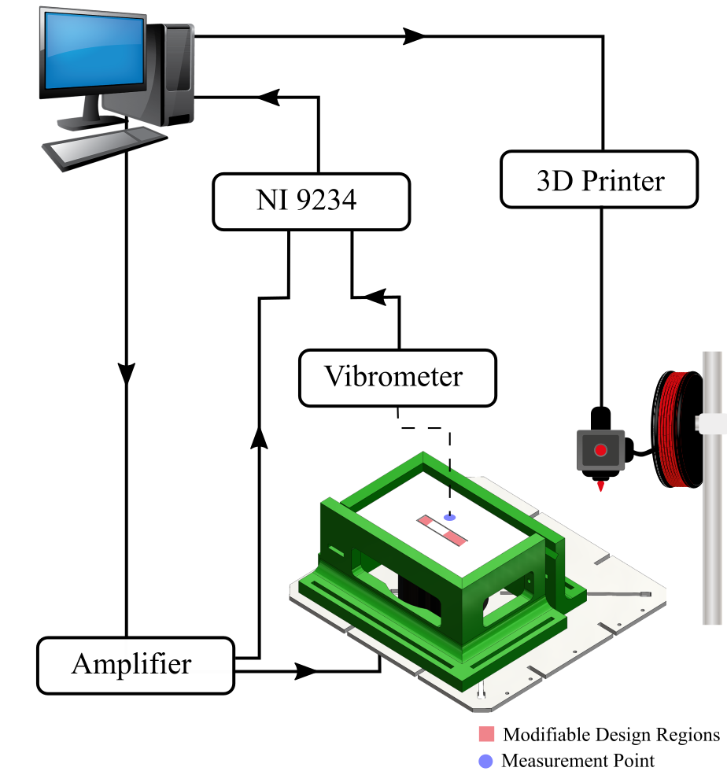

# EASER : ExperimentAl Self dEsign manufactuRing
This repository contains the data and Matlab codes implemented in the paper "Leveraging Physical Intelligence for the Self-design of High Performance Engineering Structures". 
\
\
Jessé Paixao, Emeline Sadoulet-Reboul, Emmanuel Foltête, Gaël Chevallier, Scott Cogan \
Applied Mechanics department, FEMTO-ST Institute

# Description

  

# License
This repository is released under the MIT license. See LICENSE for additional details.

